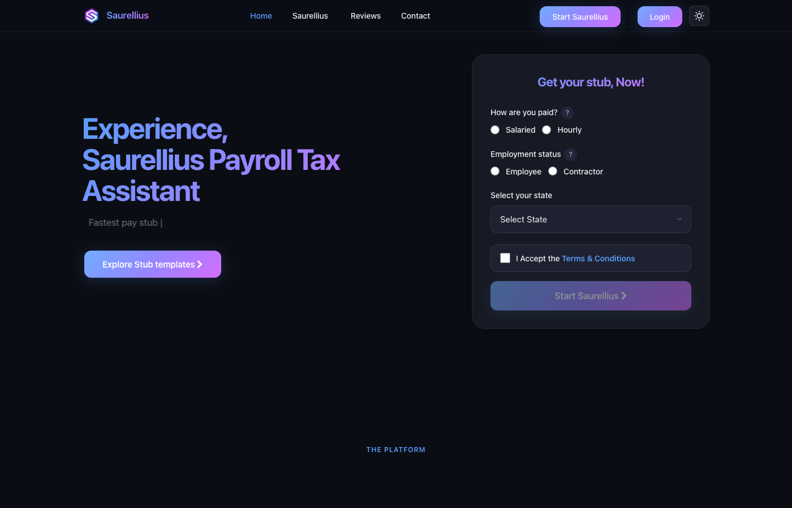
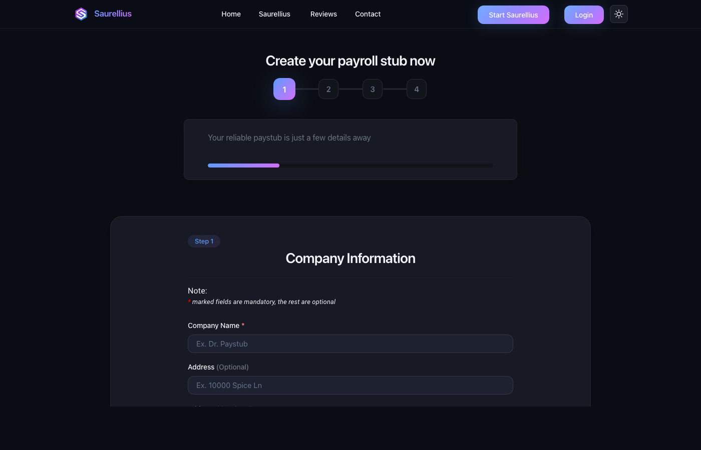
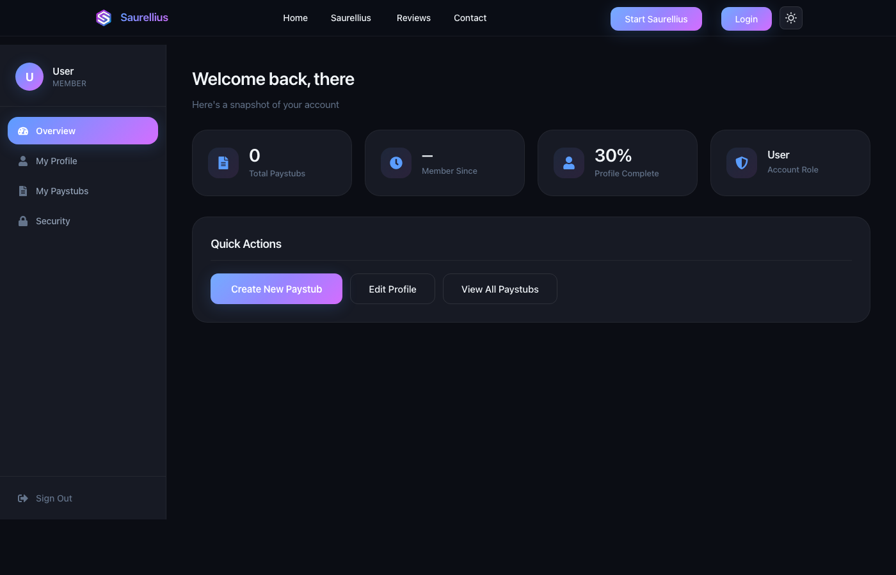
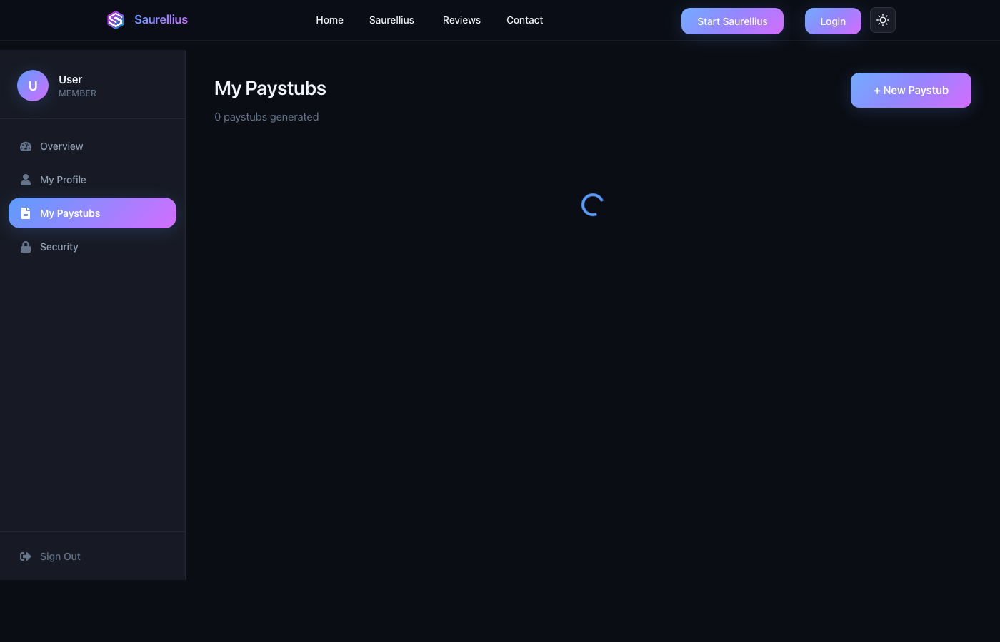
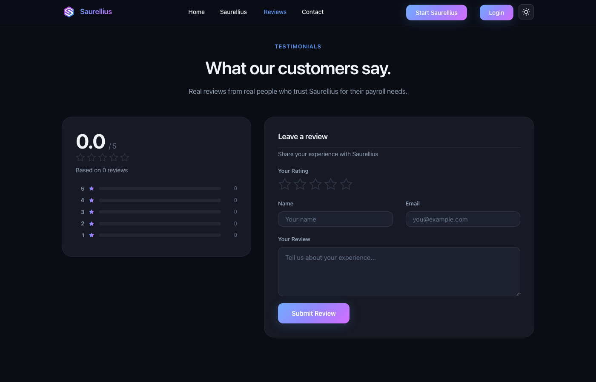
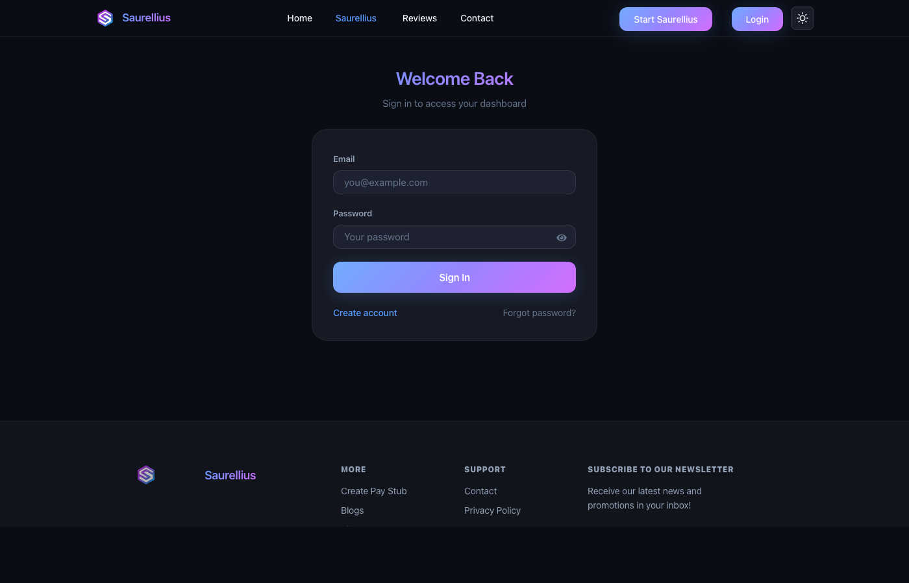

<p align="center">
  
</p>

<h1 align="center">Saurellius</h1>
<h3 align="center">by Dr. Paystub</h3>

<p align="center">
  <strong>Professional Payroll Documents &mdash; Paystubs & W-2 Forms</strong><br/>
  FICA-compliant &bull; Password-protected PDFs &bull; W-2 E-Filing &bull; SSA Integration
</p>

<p align="center">
  <a href="https://www.drpaystub.net">
    
  </a>
  
  
  
  
</p>

---

## Overview

**Saurellius** is a full-stack SaaS platform for generating professional payroll documents -- paystubs and W-2 forms. Built for small businesses, contractors, freelancers, and self-employed individuals who need accurate, compliant pay documentation.

Every generated PDF is individually password-protected, digitally watermarked, and delivered via branded email through Azure Communication Services. W-2 forms include SSA-ready e-filing in EFW2 format.

### Live Platform

> **[https://www.drpaystub.net](https://www.drpaystub.net)**

---

## Platform Screenshots

<table>
  <tr>
    <td align="center" width="50%">
      <br/>
      <sub><b>Landing Page</b> — Modern hero with rotating state selector</sub>
    </td>
    <td align="center" width="50%">
      <br/>
      <sub><b>6 Premium Templates</b> — Professional paystub layouts</sub>
    </td>
  </tr>
  <tr>
    <td align="center">
      <br/>
      <sub><b>User Dashboard</b> — Stats, recent stubs, profile completion</sub>
    </td>
    <td align="center">
      <br/>
      <sub><b>My Paystubs</b> — Expandable groups with password reveal</sub>
    </td>
  </tr>
  <tr>
    <td align="center">
      <br/>
      <sub><b>Customer Reviews</b> — Star ratings and testimonials</sub>
    </td>
    <td align="center">
      <br/>
      <sub><b>Secure Login</b> — JWT-authenticated user access</sub>
    </td>
  </tr>
</table>

---

## Key Features

### Paystub Generation
- **6 premium templates** with professional layouts
- **Multi-period support** -- generate multiple pay periods in a single order
- **Hourly & salaried** -- supports both employment types
- **All 50 US states** -- automatic federal, state, and local tax calculations
- **FICA compliant** -- Social Security, Medicare, and SDI deductions
- **Custom additions & deductions** -- overtime, bonuses, 401(k), health insurance, etc.
- **Address autocomplete** -- Google Maps Places API for employer/employee addresses

### W-2 Form Generator (W-2 Wizard)
- **4-step guided wizard** -- Employer info, Employee info, Wage/Tax boxes, Review & Pay
- **Official IRS W-2 template** -- fills all 6 copies (A, B, C, D, 1, 2) of the fw2.pdf form
- **Live PDF preview** -- watermarked preview before payment (watermarks removed on final)
- **All W-2 boxes** -- Boxes 1-20 including state/local wages, tips, deferred comp, and Box 12/13/14
- **Pre-fill from paystubs** -- auto-populates W-2 data from existing paystub history
- **E-Filing (EFW2 format)** -- download SSA-ready e-file in EFW2 specification format
- **SSA BSO portal link** -- one-click access to the Social Security Administration's free filing portal
- **Post-payment e-file CTA** -- guides users to dashboard for e-filing after purchase

### Security & Compliance
- **Password-protected PDFs** -- each stub locked with a unique password (`LASTNAME` + last 4 SSN + pay period start date `MMDDYYYY`)
- **Digital watermarking** -- invisible security layer on every document
- **QR code verification** -- document authenticity validation
- **Owner-level encryption** -- separate owner password with restricted permissions
- **Snappt-resistant** -- security features designed to pass document verification

### User Dashboard
- **Overview** -- time-of-day greeting, stat cards (groups, pay periods, member since, profile %)
- **Profile completion tracker** -- progress bar with field-by-field checklist
- **Recent paystubs feed** -- last 3 generated stubs with relative timestamps
- **Quick actions** -- one-click access to create, view, and manage
- **My Paystubs** -- expandable group cards with per-stub details and password reveal toggle
- **My W-2s** -- W-2 record cards with Download, E-File, and SSA BSO portal buttons
- **Security** -- password change with validation

### Admin Dashboard
- **Overview tab** -- total users, paid paystubs, monthly growth trends, 6-month bar chart
- **Revenue & Stripe tab** -- this month/last month revenue, Stripe balance, recent charges table
- **Users tab** -- recent signups, verified/unverified breakdown, role badges
- **Paystubs tab** -- recent paid stubs, total/paid/unpaid/weekly counts
- **Stripe mode indicator** -- live/dev badge

### Email & Notifications
- **Branded email delivery** via Azure Communication Services from `noreply@drpaystub.net`
- **Password formula included** -- each email lists the password for every attached stub
- **Purchase confirmation** -- receipt with order details
- **Email verification** -- secure signup flow

### Payments & Subscriptions
- **Stripe integration** -- secure checkout with PaymentElement
- **3-tier subscription model** -- Starter ($50/mo), Professional ($75/mo), Unlimited ($150/mo)
- **Pay-per-use** -- $20/paystub or $20/W-2 for free-tier users
- **Promo code support** -- discount codes for W-2 generation
- **Webhook handling** -- real-time payment event processing
- **Revenue tracking** -- admin-level Stripe analytics

---

## Tech Stack

| Layer | Technology |
|-------|-----------|
| **Frontend** | React 18, Redux, React Router, Bootstrap 5, SCSS |
| **Backend** | Node.js 20, Express.js, EJS templating |
| **Database** | MongoDB Atlas (Mongoose ODM) |
| **PDF Engine** | PDFKit (paystubs) + pdf-lib (W-2 forms) + Sharp (image rendering) |
| **Payments** | Stripe (PaymentElement, Subscriptions, Webhooks) |
| **Email** | Azure Communication Services |
| **Auth** | JWT with bcrypt password hashing |
| **Hosting** | Azure App Service (B2, Node 20 LTS) |
| **DNS/CDN** | Azure DNS |
| **Analytics** | Google Analytics, Facebook Pixel, Taboola, Outbrain |
| **SEO** | Google Search Console, Bing Webmaster, Yandex, IndexNow |

---

## Project Structure

```
drpaystub/
├── client/                    # React frontend
│   ├── public/                # Static assets, SEO verification files, sitemap
│   └── src/
│       ├── components/
│       │   ├── Header/        # Navigation & mobile menu
│       │   ├── Footer/        # Site footer
│       │   ├── AddressAutocomplete.js  # Google Maps Places autocomplete
│       │   └── pages/
│       │       ├── Home/      # Landing page (Hero, HowItWorks, etc.)
│       │       ├── Dashboard/ # User & Admin dashboards (MyW2s, MyPaystubs)
│       │       ├── PayStubForm/ # Multi-step paystub creator
│       │       ├── W2Wizard/  # 4-step W-2 generator with preview & e-filing
│       │       └── Blog/      # Knowledge base & articles
│       ├── data/              # Blog articles, state tax data
│       └── redux/             # State management
├── routes/
│   ├── paystub.js             # Paystub generation & Stripe checkout
│   ├── w2-wizard.js           # W-2 generation, preview, e-file (EFW2), payments
│   ├── auth.js                # Authentication & user management
│   ├── admin.js               # Admin stats & Stripe revenue API
│   ├── subscription.js        # Stripe subscription management
│   ├── stripe-webhook.js      # Stripe webhook handler
│   └── ...
├── services/
│   ├── pdf-generator-pdfkit.js # Primary PDF engine (PDFKit) for paystubs
│   ├── pdf-generator.js       # Sharp-based image renderer for paystubs
│   ├── email.service.js       # Azure ACS email service
│   ├── paystub.service.js     # Tax calculations & pay logic
│   └── ...
├── models/                    # MongoDB schemas (User, Paystub, W2Record, Subscription)
├── middlewares/                # Auth, role check, upload
├── config/                    # Tax tables, federal/state/SDI rates, local-tax.json
├── templates/                 # IRS form templates (fw2.pdf)
├── docs/                      # SSA SFTP e-file guide, deployment docs
├── views/                     # EJS paystub templates (1-6)
└── app.js                     # Express server entry point
```

---

## Getting Started

### Prerequisites
- **Node.js** 18+
- **MongoDB** (Atlas or local)
- **Stripe** account (test keys for development)

### Environment Variables

Create a `.env` file in the root directory:

```env
# Server
PORT=5000
JWT_SECRET=your_jwt_secret

# MongoDB
MONGO_URI=mongodb+srv://...

# Stripe
STRIPE_MODE=dev
STRIPE_TEST_KEY=sk_test_...
STRIPE_LIVE_KEY=sk_live_...
STRIPE_WEBHOOK_SECRET=whsec_...

# Azure Communication Services (Email)
ACS_CONNECTION_STRING=endpoint=https://...
FROM_EMAIL=noreply@drpaystub.net

# URLs
URL=http://localhost:5000
FRONTEND_URL=http://localhost:3000
```

### Installation

```bash
# Clone the repository
git clone https://github.com/diegoenterprises/drpaystub.git
cd drpaystub

# Install server dependencies
npm install

# Install client dependencies
cd client && npm install && cd ..

# Run in development (server + client concurrently)
npm run dev
```

The server runs on `http://localhost:5000` and the client on `http://localhost:3000`.

### Production Build

```bash
cd client && npm run build && cd ..
npm start
```

---

## API Endpoints

### Authentication
| Method | Endpoint | Description |
|--------|----------|-------------|
| `POST` | `/api/auth/login` | User login |
| `POST` | `/api/auth/register` | User registration |
| `GET` | `/api/auth/get-user` | Get current user |
| `PUT` | `/api/auth/update-user` | Update profile |
| `POST` | `/api/auth/change-password` | Change password |
| `GET` | `/api/auth/get-paystubs` | Get user's paystubs |

### Paystubs
| Method | Endpoint | Description |
|--------|----------|-------------|
| `POST` | `/api/paystub/getZip` | Generate & download paystub PDFs |
| `POST` | `/api/paystub/save-stub` | Save paystub to database |
| `GET` | `/api/paystub/payment-intent` | Create Stripe PaymentIntent ($20) |

### W-2 Wizard
| Method | Endpoint | Description |
|--------|----------|-------------|
| `POST` | `/api/w2-wizard/preview` | Generate watermarked W-2 preview PDF |
| `POST` | `/api/w2-wizard/generate` | Generate final W-2 PDF (all 6 copies) |
| `GET` | `/api/w2-wizard/payment-intent` | Create Stripe PaymentIntent ($20) |
| `GET` | `/api/w2-wizard/my-w2s` | Get user's saved W-2 records |
| `GET` | `/api/w2-wizard/efile/:id` | Download EFW2-format e-file for SSA |
| `GET` | `/api/w2-wizard/prefill-from-paystubs` | Auto-fill W-2 from paystub history |

### Subscriptions
| Method | Endpoint | Description |
|--------|----------|-------------|
| `POST` | `/api/subscription/checkout` | Create Stripe Checkout Session |
| `GET` | `/api/subscription/status` | Get current subscription tier & limits |

### Admin (requires `admin` role)
| Method | Endpoint | Description |
|--------|----------|-------------|
| `GET` | `/api/admin/stats` | Platform stats (users, paystubs, trends) |
| `GET` | `/api/admin/stripe-revenue` | Stripe revenue & charges |
| `GET` | `/api/auth/get-all-users` | Paginated user list |
| `GET` | `/api/auth/get-admin-paystubs` | Paginated paystub list |

---

## PDF Password Formula

Each generated paystub PDF is locked with a unique password:

```
LASTNAME + LAST4SSN + MMDDYYYY
```

| Component | Source | Example |
|-----------|--------|---------|
| `LASTNAME` | Employee last name (uppercase) | `SMITH` |
| `LAST4SSN` | Last 4 digits of SSN | `4567` |
| `MMDDYYYY` | Pay period start date | `01152026` |

**Example password:** `SMITH456701152026`

---

## W-2 E-Filing (EFW2 Format)

The platform generates SSA-compliant EFW2 files per SSA Publication No. 31-011:

| Record | Purpose |
|--------|--------|
| **RA** | Submitter identification |
| **RE** | Employer identification |
| **RW** | Employee wage data (W-2 boxes 1-20) |
| **RS** | State wage data (if applicable) |
| **RT** | Employer totals |
| **RU** | State totals |
| **RF** | Final record |

Users download the `.txt` file and upload it to the **SSA Business Services Online (BSO)** portal at [ssa.gov/bso](https://www.ssa.gov/bso/bsowelcome.htm) -- completely free.

See [`docs/SSA_DIRECT_SFTP_EFILE_GUIDE.md`](docs/SSA_DIRECT_SFTP_EFILE_GUIDE.md) for future direct SFTP integration guidelines.

---

## Deployment

The platform is deployed on **Azure App Service** with the following infrastructure:

- **App Service:** `drpaystub-app` (B2 plan, Node.js 20 LTS)
- **Database:** MongoDB Atlas
- **Email:** Azure Communication Services (`noreply@drpaystub.net`)
- **DNS:** Azure DNS for `drpaystub.net`
- **Payments:** Stripe (live mode -- PaymentElement + Subscriptions)
- **SEO:** Google Search Console, Bing Webmaster, Yandex Webmaster, IndexNow

### Deploy to Azure

```bash
# Build frontend
cd client && npm run build && cd ..

# Create deployment zip (no node_modules)
zip -r /tmp/drpaystub-deploy.zip . -x "node_modules/*" "client/node_modules/*" ".git/*"

# Deploy
az webapp deploy --resource-group drpaystub-prod --name drpaystub-app \
  --src-path /tmp/drpaystub-deploy.zip --type zip
```

---

## Subscription Tiers

| Tier | Price | Paystub Groups/mo | W-2s/mo | Pay Periods |
|------|-------|-------------------|---------|-------------|
| **Free** | $20/doc | Pay-per-use | Pay-per-use | 6 |
| **Starter** | $50/mo | 5 | -- | 6 |
| **Professional** | $75/mo | 15 | 2 | 12 |
| **Unlimited** | $150/mo | Unlimited | Unlimited | Unlimited |

---

## License

Proprietary software. All rights reserved.

**Saurellius** is a product of **Eusorone Technologies Inc.**

---

<p align="center">
  <br/>
  <sub>Built with precision by <a href="https://github.com/diegoenterprises">Diego Enterprises</a></sub>
</p>